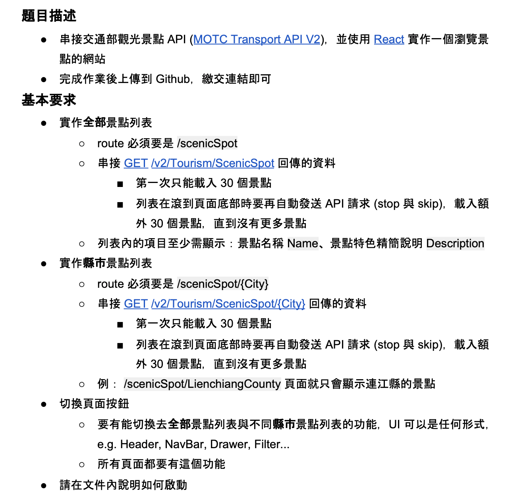

## Project Description

## Available Scripts

In the project directory, you can run:

### `npm install`
Install all packege related to the project

### `npm start`

Runs the app in the development mode.\
Open [http://localhost:3000](http://localhost:3000) to view it in the browser.

The page will reload if you make edits.\
You will also see any lint errors in the console.

### `npm run build`

Builds the app for production to the `build` folder.\
It correctly bundles React in production mode and optimizes the build for the best performance.

The build is minified and the filenames include the hashes.\
Your app is ready to be deployed!

See the section about [deployment](https://facebook.github.io/create-react-app/docs/deployment) for more information.

## Deployment
I take firebase as example,install firebase CLI first

`npm install -g firebase-tools`

then make some configuration

`firebase init`

the following options are:

- Hosting: Configure and deploy Firebase Hosting sites
- What do you want to use as your public directory?(build)
- Configure as a single-page app (rewrite all urls to /index.html)? (y)
- Set up automatic builds and deploys with GitHub? No
- File build/index.html already exists. Overwrite? No

And then appoint firebase project

`firebase use [project_id]`

And build and deploy

`npm run build && firebase deploy`

### Demo
https://dcard-project.web.app
